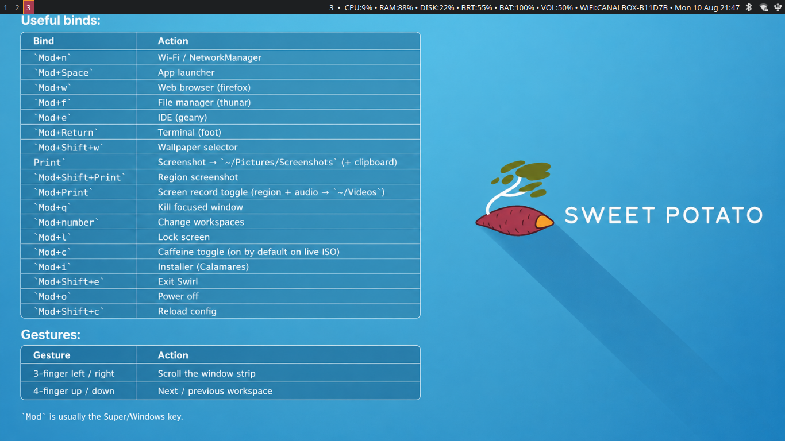
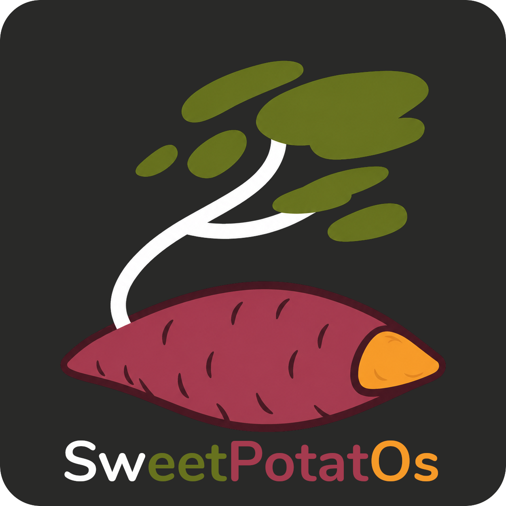

https://github.com/user-attachments/assets/c4e14323-38b3-44b9-8084-5d25a45755ee


# SweetPotatOs

<p align="center">
  
</p>

<table>
  <tr>
    <td>
      <strong>SweetPotatOs is an Arch-based Linux distro: a live graphical ISO with the SweetPotato Swirl desktop and a Calamares installer, built to revive slow old potato PCs and make them sweet again.
<br>
    </td>
    <td>
  
</td>
  </tr>
</table>

## What you get

- Live Swirl session (`liveuser`, empty password, sudo without password)
- Autologin on tty1 → SweetPotato Swirl desktop (foot, Thunar, mako, NetworkManager, …)
- Installer autostarts on the live desktop; also **Mod+i**, desktop *Install SweetPotatOs*, or `sweetpotatos-calamares`
- Installed system uses the live squashfs, GRUB, and **Ly** on tty2

## Download

Get the ISO and `.sha256` from SourceForge Files (newest release folder):

**[Download SweetPotatOs](https://sourceforge.net/projects/sweetpotatos/files/)** · [Project page](https://sourceforge.net/projects/sweetpotatos/)

Verify after download:

```bash
sha256sum -c Sweetpotatos_*.iso.sha256
```

To publish a new build from this repo:

```bash
SF_USER=your_sourceforge_username SF_RELEASE=YYYY.MM.DD ./sourceforge/upload.sh
```

Then in SourceForge: Files → that release → ⓘ on the `.iso` → set as default download.

Overlay packages for `spo-upgrade` are published to GitHub (not SourceForge):

```bash
./github/upload-repo.sh
```

## Prerequisites

- Arch-based build host
- Root privileges (`mkarchiso`)
- Packages: `archiso`, `base-devel`, `git`
- Local **Calamares** + **swirl** + **yay-bin/shelly-bin/localsend-bin/spore** packages (see `sudo ./build.sh --build-packages`)

## Build

```bash
git clone https://github.com/visnudeva/SweetPotatOs.git
cd SweetPotatOs

# First time only — build Calamares into ./repo
sudo ./build.sh --build-packages
# or separately: --build-calamares / --build-swirl

# Build the ISO
sudo ./build.sh
```

ISO output: `out/Sweetpotatos_*.iso` (e.g. `Sweetpotatos_2026.08_First_Harvest.iso`)
Work tree: `work/` (removed automatically at the start of each ISO build)

### Local Calamares repo

`profile/pacman.conf` includes:

```ini
[sweetpotatos]
SigLevel = Optional TrustAll
Server = file:///ABS/PATH/TO/SweetPotatOs/repo
```

Update the `Server =` path if you clone the repo somewhere other than `/home/visnudeva/SweetPotatOs`.

## Live session

| Item | Value |
|------|--------|
| User | `liveuser` |
| Password | empty (Enter) |
| Desktop | Swirl + SweetPotato |
| Caffeine | **on by default** (no sleep/lock during install) |

### Default apps

Shipped stack (2026.08+): **Spore** (web radio + local music) and **LocalSend** (nearby file sharing) replace the earlier **tera** terminal radio and **Audacious** music player.

| Role | App |
|------|-----|
| Browser | Firefox |
| Files | Thunar |
| Editor | Geany |
| Calculator | galculator |
| Terminal | foot |
| Video | mpv + yt-dlp |
| Image edit | GIMP |
| Music / radio | Spore |
| Nearby share | LocalSend |
| PDF | mupdf |
| Images | swayimg |
| Torrents | Transmission |
| Webcam | guvcview |
| Color picker | hyprpicker |
| Packages | Shelly (+ yay / AUR) |
| Disks | GNOME Disks |
| System monitor | btop |

### Useful binds

| Bind | Action |
|------|--------|
| `Mod+n` | Wi‑Fi / NetworkManager |
| `Mod+Space` | App launcher |
| `Mod+w` | Web browser (firefox) |
| `Mod+f` | File manager (thunar) |
| `Mod+e` | IDE (geany) |
| `Mod+r` | Music / radio (Spore) |
| `Mod+Return` | Terminal (foot) |
| `Mod+m` | Expand focused column to 100% / restore 50/50 |
| `Mod+Shift+w` | Wallpaper selector (waypaper) |
| `Mod+Shift+r` | Resize mode (arrow keys; Enter/Esc to exit) |
| `Print` | Screenshot → `~/Pictures/Screenshots` (+ clipboard) |
| `Mod+Shift+Print` | Region screenshot |
| `Mod+Print` | Screen record toggle (region + audio → `~/Videos`) |
| `Mod+q` | Kill focused window |
| `Mod+number` | Change workspaces |
| `Mod+Up` / `Mod+Down` | Switch workspace up / down |
| `Mod+Ctrl+Up` / `Mod+Ctrl+Down` | Move window to workspace above / below |
| `Mod+Shift+number` | Move window to workspace 1–10 |
| `Mod+l` | Lock screen |
| `Mod+c` | Caffeine toggle (on by default on live ISO) |
| `Mod+i` | Installer (Calamares) |
| `Mod+Shift+e` | Exit Swirl |
| `Mod+o` | Power off |
| `Mod+Shift+c` | Reload config |

`Mod` is usually the Super/Windows key. A one-shot tips notification lists the main binds after login (every live boot; once on an installed user).

### Gestures

| Gesture | Action |
|---------|--------|
| 3-finger left / right | Scroll the window strip |
| 4-finger up / down | Next / previous workspace |

## Write ISO to USB

On a SweetPotato desktop, **Disks** (gnome-disks) → select USB → *Restore Disk Image…*  
(Polkit rules in SweetPotato allow `wheel` users to do this on Swirl.)

Or:

```bash
lsblk   # find the USB disk, e.g. /dev/sdX — not a partition
sudo dd if=out/Sweetpotatos_*.iso of=/dev/sdX bs=4M status=progress oflag=sync
```

## Layout

```
SweetPotatOs/
├── assets/           # README / branding art (Screenshot.png, SweetPotatOs.png, SPLogo.png)
├── build.sh          # --build-packages / --build-swirl / --build-calamares | mkarchiso
├── packaging/swirl/  # PKGBUILD for the swirl compositor
├── sync-theme.sh     # pull SweetPotato → airootfs + $HOME
├── profile/          # archiso profile
│   ├── profiledef.sh
│   ├── packages.x86_64
│   ├── pacman.conf
│   └── airootfs/     # live overlay (skel, Calamares, NetworkManager, …)
├── repo/             # local pacman repo (calamares + swirl *.pkg.tar.*)
├── github/           # upload-repo.sh — overlay packages → GitHub Release pacman-repo
├── sourceforge/      # ISO + project web upload.sh (rsync); Files stay ISO-only
├── out/              # built ISOs (gitignored)
└── work/             # mkarchiso work dir (gitignored)
```

Theme files are mirrored from [SweetPotato](https://github.com/visnudeva/SweetPotato) into `profile/airootfs/etc/skel` and `home/liveuser`. Re-sync after theme updates:

```bash
./sync-theme.sh
```


## Known limitations

- First ISO build needs Calamares present in `repo/`
- `unpackfs` expects the ISO mounted at `/run/archiso/bootmnt/spotato/...`
- Desktop stack → large ISO

## Related

- Theme / post-install script to install on another distro: https://github.com/visnudeva/SweetPotato

## License

SweetPotato theme configs follow that repository’s license.  
Archiso profile layout follows Arch Linux archiso licensing.
